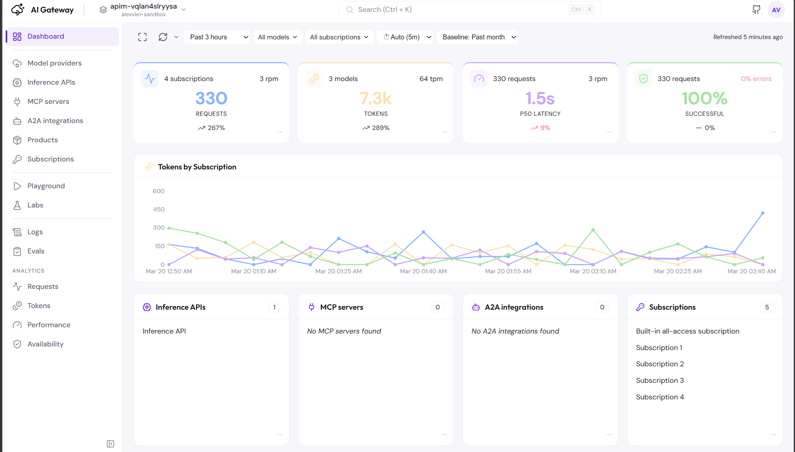

# AI Gateway Dev Portal

A starting point for building your own developer portal on top of Azure API Management AI Gateways. Fork it, open it in VS Code with GitHub Copilot (or any coding agent), and shape it to fit your organization.

This isn't a finished product — it's a foundation. The codebase is structured so that an AI coding assistant can understand and extend it: clear page patterns, consistent component conventions, and a single CSS file with predictable class naming. Ask your agent to add a page, wire up a new API, or restyle the whole thing.


## Quick start

Try the hosted version at **https://icy-water-005686203.6.azurestaticapps.net** — sign in with your Azure credentials or an access token.



Three sign-in options out of the box:
- **Microsoft Entra ID** — MSAL redirect flow with multi-tenant support
- **Bring your own app registration** — supply your own Entra ID client ID (and optional tenant) from the sign-in page, no rebuild required
- **Access token** — paste a token from `az account get-access-token` for quick CLI-based access

## What's included

The portal ships with working pages that cover the core Azure API Management AI gateway surface. Use them as-is, modify them, or tear them out and build something different.

| Page | What it does |
|---|---|
| **Dashboard** | At-a-glance KPI tiles (requests, tokens, latency, availability) with trend indicators against a configurable baseline (day/week/month/year). Tokens-by-subscription line chart with interactive legend. Resource list tiles for Inference APIs, MCP Servers, A2A Integrations, and Subscriptions with click-through navigation. |
| **Model providers** | Browse AI backends with auto-detected provider types (Foundry, Azure OpenAI, OpenAI, Gemini, Anthropic, Bedrock, Hugging Face). Inspect pool members, weights, priorities, and circuit breaker rules. |
| **Inference APIs** | List inference APIs with provider badges, tag filtering, and detail panels showing subscriptions, revisions, releases, and products. |
| **MCP servers** | Manage Model Context Protocol servers and API-backed MCP endpoints. Filter by source type. |
| **A2A integrations** | Browse agent-to-agent configurations with agent IDs and routing paths. |
| **Products** | Full CRUD — create, publish, unpublish, delete products and manage API associations. |
| **Subscriptions** | Manage keys (masked display, copy, regenerate), state (activate, suspend, cancel), and scoped access. |
| **Playground** | Interactive chat for testing any inference API. Streaming, code generation (JS/Python/cURL), full gateway trace visualization, token usage breakdown, and MCP tool selection. |
| **Labs** | Browse educational lab scenarios from the AI Gateway community. Search, filter by category/service/tags, sort, and view architecture diagrams with links to GitHub repos. |
| **Logs** | KQL queries against `ApiManagementGatewayLlmLog` with time range and model filters. Click any row for full input/output. |
| **Evals** | *(Coming soon)* Extract AI Gateway logs and run model, tools, and agent evaluations. |
| **Requests** | Request volume analytics — requests over time by subscription and by model, success vs error breakdown, and latency distribution. Shared toolbar with time range, granularity, and multi-select model/subscription filters. |
| **Tokens** | Token usage analytics — total tokens over time by subscription, input/output token breakdown, and throughput charts. |
| **Performance** | Latency analytics — P50/P95/P99 percentile trends, latency by model, request throughput, and ms-per-token efficiency. |
| **Availability** | Reliability analytics — success/error rates over time, success rate percentage, throttling trends, and error breakdown by response code. |

### Shared analytics features

All analytics pages (Dashboard, Requests, Tokens, Performance, Availability) share a common toolbar with:

- **Time range** — 30m to 30d presets, or custom date range picker
- **Auto-refresh** — configurable interval (1/5/15/30 min)
- **Granularity** — auto or manual (1m to 30d), resolved based on time range
- **Filters** — multi-select model and subscription dropdowns
- **Fullscreen** — expand any chart section to full screen
- **Interactive legends** — hover to highlight a series, click to lock focus

Plus: workspace selector (subscription → APIM instance → workspace), global `Ctrl+K` search, light/dark/system theme, and multi-tenant directory switching.

---

## Extend it with a coding agent

The codebase follows repeatable patterns designed for AI-assisted development:

- **Pages** follow a consistent structure: toolbar (search + filters) → table → detail panel. Adding a new page means replicating this pattern.
- **Services** are centralized in `src/services/azure.ts` — all Azure SDK and REST API calls in one file.
- **Types** live in `src/types.ts` — all interfaces in one place.
- **Styles** use a single `src/index.css` with BEM-like prefixed classes (`.sub-*`, `.mp-*`, `.logs-*`).
- **Navigation** is a single array in `src/components/Sidebar.tsx`.

**Example prompts for your coding agent:**

- *"Add a new page that shows API analytics with charts"*
- *"Add a cost tracking column to the Logs table"*
- *"Add RBAC — show different pages based on user roles"*
- *"Add a Terraform export button for the selected APIM configuration"*
- *"Change the theme colors to match our company brand"*
- *"Add rate limit information to the Inference APIs detail panel"*

The repo also includes a [KQL skill](.github/skills/apim-kql/SKILL.md) with Azure Monitor table schemas and query examples — coding agents that support skills can use this to generate accurate KQL queries.

---

## Prerequisites

- [Node.js](https://nodejs.org/) 20+
- An Azure subscription with at least one API Management instance
- [Azure CLI](https://learn.microsoft.com/cli/azure/install-azure-cli) (`az`) for deployment

---

## 1. Configure the Entra ID app registration

In the [Azure portal](https://portal.azure.com) → **Microsoft Entra ID → App registrations → New registration**:

| Setting | Value |
|---|---|
| Name | `AI Gateway Dev Portal` |
| Supported account types | **Accounts in any organizational directory** (multi-tenant) |
| Redirect URI — Platform | **Single-page application (SPA)** |
| Redirect URI — URI | `http://localhost:5173` |

Note the **Application (client) ID**.

Or via CLI:

```bash
az ad app create \
  --display-name "AI Gateway Dev Portal" \
  --sign-in-audience AzureADMultipleOrgs
```

Add the SPA redirect URI (if created via CLI):

```bash
OBJECT_ID=$(az ad app show --id <APP_ID> --query id -o tsv)

az rest --method PATCH \
  --uri "https://graph.microsoft.com/v1.0/applications/$OBJECT_ID" \
  --headers "Content-Type=application/json" \
  --body '{"spa":{"redirectUris":["http://localhost:5173"]}}'
```

Add the required API permission:

```bash
az ad app permission add \
  --id <APP_ID> \
  --api 797f4846-ba00-4fd7-ba43-dac1f8f63013 \
  --api-permissions 41094075-9dad-400e-a0bd-54e686782033=Scope
```

When deploying, add your deployed URL as an additional redirect URI:

```bash
az rest --method PATCH \
  --uri "https://graph.microsoft.com/v1.0/applications/$OBJECT_ID" \
  --headers "Content-Type=application/json" \
  --body '{"spa":{"redirectUris":["http://localhost:5173","https://<your-deployed-url>"]}}'
```

---

## 2. To run locally

```bash
git clone https://github.com/vieiraae/ai-gateway-dev-portal.git
cd ai-gateway-dev-portal
npm install
cp .env.example .env   # set VITE_AZURE_CLIENT_ID to your app's client ID
npm run dev
```

Open `http://localhost:5173` and sign in.

> The dev server includes a built-in CORS proxy (`/gateway-proxy/*` → APIM gateway), so the Playground works without additional CORS configuration.

---

## 3. Deploy

Build first (Vite inlines env vars at build time):

```bash
export VITE_AZURE_CLIENT_ID=<YOUR_CLIENT_ID>
npm run build
```

<details>
<summary><strong>Windows (PowerShell)</strong></summary>

```powershell
$env:VITE_AZURE_CLIENT_ID = "<YOUR_CLIENT_ID>"
npm run build
```
</details>

### Option A: Azure Static Web Apps

```bash
az staticwebapp create \
  --name ai-gateway-dev-portal \
  --resource-group <RESOURCE_GROUP> \
  --location eastus2 \
  --sku Free

SWA_TOKEN=$(az staticwebapp secrets list \
  --name ai-gateway-dev-portal \
  --resource-group <RESOURCE_GROUP> \
  --query properties.apiKey -o tsv)

npx @azure/static-web-apps-cli deploy ./dist \
  --deployment-token $SWA_TOKEN \
  --env default
```

### Option B: Azure Container Apps

No Dockerfile needed:

```bash
az containerapp up \
  --name ai-gateway-dev-portal \
  --resource-group <RESOURCE_GROUP> \
  --location <LOCATION> \
  --source ./dist \
  --ingress external \
  --target-port 80
```

After deploying, add the app URL as a SPA redirect URI (see step 1).

---

## 4. CI/CD with GitHub Actions

Add secrets in **Settings → Secrets → Actions**:

| Secret | Value |
|---|---|
| `AZURE_STATIC_WEB_APPS_API_TOKEN` | SWA deployment token |
| `VITE_AZURE_CLIENT_ID` | Entra ID app client ID |

Create `.github/workflows/deploy.yml`:

```yaml
name: Deploy to Azure Static Web Apps

on:
  push:
    branches: [main]
  pull_request:
    types: [opened, synchronize, reopened, closed]
    branches: [main]

jobs:
  build-and-deploy:
    if: github.event_name == 'push' || (github.event_name == 'pull_request' && github.event.action != 'closed')
    runs-on: ubuntu-latest
    steps:
      - uses: actions/checkout@v4
      - name: Build and deploy
        uses: Azure/static-web-apps-deploy@v1
        with:
          azure_static_web_apps_api_token: ${{ secrets.AZURE_STATIC_WEB_APPS_API_TOKEN }}
          repo_token: ${{ secrets.GITHUB_TOKEN }}
          action: upload
          app_location: /
          output_location: dist
        env:
          VITE_AZURE_CLIENT_ID: ${{ secrets.VITE_AZURE_CLIENT_ID }}

  close-pull-request:
    if: github.event_name == 'pull_request' && github.event.action == 'closed'
    runs-on: ubuntu-latest
    steps:
      - name: Close staging environment
        uses: Azure/static-web-apps-deploy@v1
        with:
          azure_static_web_apps_api_token: ${{ secrets.AZURE_STATIC_WEB_APPS_API_TOKEN }}
          action: close
```

---

## Project structure

```
src/
├── App.tsx                    # Routes and auth gating
├── main.tsx                   # MSAL + theme + token auth providers
├── types.ts                   # All TypeScript interfaces
├── index.css                  # All styles (single file, prefixed classes)
├── config/msal.ts             # MSAL configuration
├── context/
│   ├── AzureContext.tsx        # Central state: subscriptions, services, workspace data
│   ├── TokenAuthContext.tsx    # Access token auth state
│   └── ThemeContext.tsx        # Light/dark/system theme
├── services/azure.ts          # All Azure SDK + REST API calls
├── hooks/
│   └── useLegendHighlight.ts  # Interactive chart legend highlight + lock
├── components/
│   ├── Layout.tsx              # Shell (header + sidebar + content)
│   ├── Header.tsx              # Top bar with workspace selector + search
│   ├── Sidebar.tsx             # Navigation (single navItems array)
│   ├── AnalyticsToolbar.tsx    # Shared filters, time range, granularity, auto-refresh
│   ├── SearchBar.tsx           # Ctrl+K global search
│   ├── LoginPage.tsx           # Entra ID + token sign-in
│   ├── WorkspaceSelector.tsx   # Subscription → APIM → workspace picker
│   ├── UserMenu.tsx            # Profile, tenant switcher, theme, sign out
│   ├── CodeModal.tsx           # Generated code snippets (JS/Python/cURL)
│   ├── TraceModal.tsx          # Gateway trace pipeline viewer
│   ├── ConfirmModal.tsx        # Reusable confirmation dialog
│   └── LoadingModal.tsx        # Workspace loading progress
└── pages/
    ├── Dashboard.tsx           # KPI tiles, trend chart, resource list tiles
    ├── Requests.tsx            # Request volume analytics (drill-down)
    ├── Tokens.tsx              # Token usage analytics (drill-down)
    ├── Performance.tsx         # Latency & throughput analytics (drill-down)
    ├── Availability.tsx        # Success rate & error analytics (drill-down)
    ├── ModelProviders.tsx      # AI backends + pool/circuit breaker tabs
    ├── InferenceApis.tsx       # APIs with revisions, releases, products
    ├── McpServers.tsx          # MCP server management
    ├── A2A.tsx                 # Agent-to-agent configs
    ├── Playground.tsx          # Chat, streaming, tracing, code gen
    ├── Products.tsx            # Product CRUD + API associations
    ├── Subscriptions.tsx       # Key management + state control
    ├── Logs.tsx                # KQL-based LLM log viewer
    ├── Labs.tsx                # Educational lab scenario browser
    ├── Evals.tsx               # Evaluation runner (coming soon)
    └── NamedValues.tsx         # Named value management (coming soon)
```

---

## Model provider detection

Backends are auto-classified by URL pattern:

| URL pattern | Provider |
|---|---|
| `*.cognitiveservices.azure.com`, `*.services.ai.azure.com` | Foundry |
| `*.openai.azure.com` | Azure OpenAI |
| `generativelanguage.googleapis.com` | Gemini |
| `api.openai.com` | OpenAI |
| `api.anthropic.com` | Anthropic |
| `*.amazonaws.com`, `*.api.aws` | Bedrock |
| `*.huggingface.co` | Hugging Face |

For backend pools, the type is inferred from the first member that matches.

---

## Tech stack

| Layer | Technology |
|---|---|
| Framework | React 19 + TypeScript 5.9 |
| Build | Vite 8 |
| Auth | MSAL Browser + MSAL React |
| Charts | Recharts |
| Azure SDK | `@azure/arm-apimanagement`, `@azure/arm-monitor`, `@azure/arm-machinelearning`, `@azure/arm-resources-subscriptions` |
| Icons | Lucide React |
| Routing | React Router 7 |
| Linting | ESLint (`recommendedTypeChecked` + `stylisticTypeChecked`) |

## License

[MIT](LICENSE)